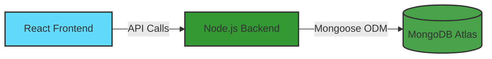

<div align="center">
  <h1>📚 Student Management CRUD Application</h1>
  <p>A full-stack MERN application for managing student records with complete CRUD functionality</p>
  
  <!-- Badges -->
  <p>
    
    
    
    
    
  </p>
  
  <!-- Live Demo Buttons -->
  <p>
    <a href="https://your-frontend-url.onrender.com" target="_blank">
      
    </a>
    <a href="https://your-backend-url.onrender.com" target="_blank">
      
    </a>
    <a href="https://github.com/ImtiazAdar7/crud-app" target="_blank">
      
    </a>
  </p>
</div>

---

## 👨‍💻 About The Developer

<div align="center">
  <table>
    <tr>
      <td align="center">
        
      </td>
    </tr>
    <tr>
      <td align="center">
        <h3>Imtiaz Ahmed Adar</h3>
        <p>Full Stack Developer | MERN Specialist</p>
        <p>
          <a href="https://linkedin.com/in/imtiaz-ahmed-adar" target="_blank">
            
          </a>
          <a href="https://github.com/ImtiazAdar7" target="_blank">
            
          </a>
          <a href="mailto:imtiazadarofficial@gmail.com">
            
          </a>
        </p>
      </td>
    </tr>
  </table>
</div>

---

## 📋 Project Overview

A comprehensive **Student Management System** that demonstrates full CRUD (Create, Read, Update, Delete) operations with a clean, responsive interface.

### ✨ Key Features

| Feature | Description |
|---------|-------------|
| **➕ Create** | Add new students with complete details |
| **📖 Read** | View all students in a sortable table |
| **✏️ Update** | Edit existing student information |
| **❌ Delete** | Remove student records |
| **🔍 Search** | Filter by first name, last name, or email |
| **📱 Responsive** | Works perfectly on all devices |

---

## 🏗️ Architecture



### 🛠️ Technology Stack
Backend Technologies  
├── 🟢 Node.js - JavaScript runtime environment  
├── ⚡ Express.js - Web application framework  
├── 🍃 MongoDB Atlas - Cloud database service  
├── 📦 Mongoose - MongoDB object modeling  
├── 🔐 UUID - Unique identifier generation  
├── 🔗 CORS - Cross-Origin Resource Sharing  
└── 🌐 dotenv - Environment variable management  

Frontend Technologies  
├── ⚛️ React 19 - UI library  
├── 🏃 Vite - Build tool and dev server  
├── 🚦 React Router DOM - Navigation and routing  
├── 📡 Axios - HTTP client for API requests  
└── 🎨 CSS3 - Styling and responsive design  

### 📁 Project Structure
📦 crud-app  
├── 📂 backend  
│   ├── 📂 config  
│   │   └── 📄 database.js  
│   ├── 📂 controllers  
│   │   └── 📄 student_controller.js  
│   ├── 📂 models  
│   │   └── 📄 student_model.js  
│   ├── 📂 routes  
│   │   └── 📄 student_routes.js  
│   ├── 📄 app.js  
│   ├── 📄 server.js  
│   └── 📄 package.json  
│
└── 📂 frontend  
    ├── 📂 src  
    │   ├── 📂 api  
    │   │   └── 📄 api.js  
    │   ├── 📂 pages  
    │   │   ├── 📄 AddStudent.jsx  
    │   │   ├── 📄 StudentList.jsx  
    │   │   └── 📄 UpdateStudent.jsx  
    │   ├── 📄 App.jsx  
    │   ├── 📄 main.jsx  
    │   └── 📄 index.css  
    ├── 📄 index.html  
    └── 📄 package.json  


### 🧪 Testing Your Deployed App
Test All CRUD Operations
| Operation | How to Test | Expected Result |
|-----------|-------------|-----------------|
| Create | Click "Add Student", fill form, submit | New student appears in list |
| Read | Load homepage | All students displayed |
| Update | Click "Update" on any student, modify, save | Changes reflected |
| Delete | Click "Delete" on any student | Student removed from list |
| Search | Type in search fields | List filters in real-time |


### 🔒 Security Best Practices
✅ Environment variables stored securely in Render

✅ .env files excluded from version control

✅ MongoDB connection string secured

✅ CORS properly configured

✅ Input validation on backend

### 📝 API Documentation
Base URL
```
https://your-backend-url.onrender.com/api
```

Endpoints

| Method | Endpoint | Description |
|--------|----------|-------------|
|GET | /students | Get all students |
| GET | /students/:ID | Get single student |
| POST | /students | Add new student |
| PUT | /students/:ID | Update student |
| DELETE | /students/:ID | Delete student |

Sample Student Object
```
{
  "ID": "550e8400-e29b-41d4-a716-446655440000",
  "firstName": "Imtiaz",
  "lastName": "Adar",
  "email": "imtiazadar@example.com",
  "age": 25,
  "gender": "Male",
  "designation": "Software Engineer"
}
```

### 📄 License
<div align="center"> 
Copyright © 2026 Imtiaz Ahmed Adar

</div>

### 📞 Contact & Support
<div align="center"> <table> <tr> <td align="center"> <a href="https://linkedin.com/in/imtiaz-ahmed-adar">  </a> </td> <td align="center"> <a href="https://github.com/ImtiazAdar7">  </a> </td> <td align="center"> <a href="mailto:imtiazadarofficial@gmail.com">  </a> </td> </tr> </table> <p>⭐ Star this repository if you found it helpful!</p> </div>
<div align="center"> <h3>🚀 Happy Coding!</h3> <p>Built with ❤️ by <strong>Imtiaz Ahmed Adar</strong></p> <p>© 2026 All Rights Reserved</p> </div>